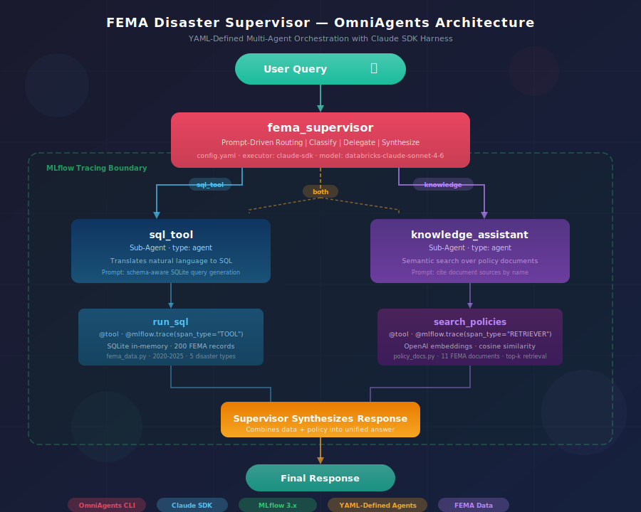
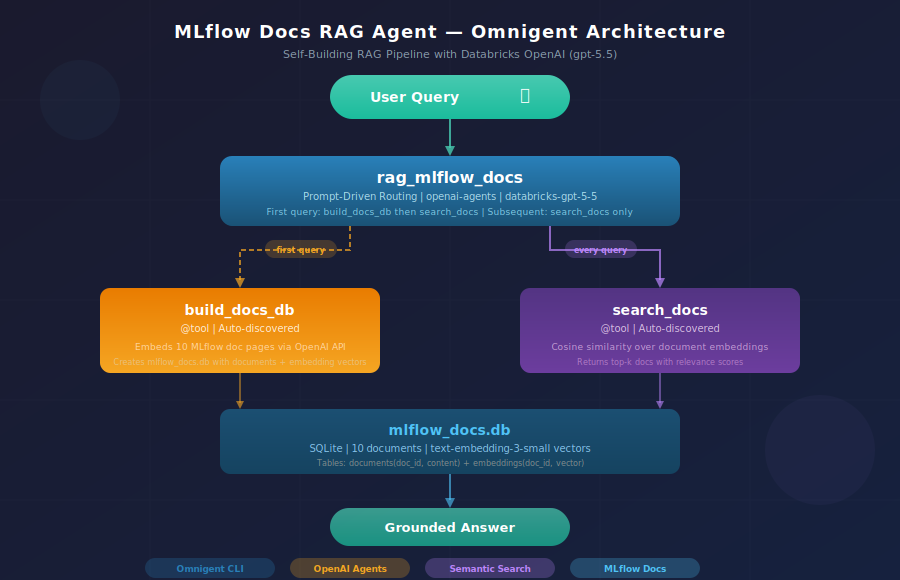
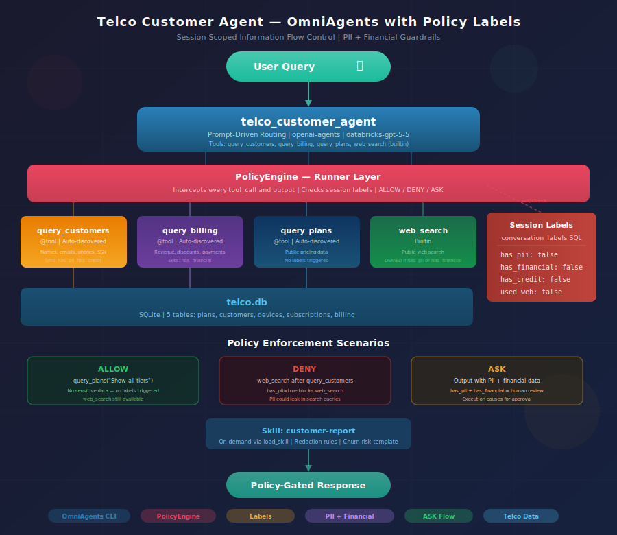

# OmniAgents Harness

**YAML-defined AI agents for the OmniAgents CLI -- from single-tool assistants to multi-tool disaster response agents.**


---

## Overview

This repository contains example agent configurations for the [OmniAgents](https://github.com/databricks/omniagents) CLI. Each example defines an AI agent in YAML -- specifying the executor, system prompt, and tools. Three flagship examples demonstrate different patterns:

1. **FEMA Disaster Agent** -- multi-tool routing (text-to-SQL + semantic policy search)
2. **MLflow Docs RAG Agent** -- self-building RAG pipeline (embeds documents, then searches them)
3. **Telco Customer Agent** -- multi-tool customer data agent with PII/financial policy labels (planned)

### FEMA Disaster Agent

The FEMA agent (`examples/fema_supervisor/`) has two auto-discovered tools with prompt-driven routing:

- **`run_sql`** -- Executes SQLite queries against a local database (`fema_disaster.db`) containing 80 FEMA disaster records (2020--2025). Uses Python's built-in `sqlite3` -- no external SQL warehouse.

- **`search_policies`** -- Semantic search over 9 FEMA policy documents (evacuation protocols, disaster declarations, aid eligibility, flood/wildfire/hurricane/earthquake/tornado procedures). Uses OpenAI embeddings and cosine similarity. Requires `OPENAI_API_KEY` in a `.env` file at the repo root.

The agent's prompt enforces strict tool usage: data questions go to `run_sql`, policy questions go to `search_policies`, combined questions use both. The agent never falls back to training data.

### MLflow Docs RAG Agent

The RAG agent (`examples/rag_mlflow_docs/`) answers questions about MLflow by searching a local corpus of 10 documentation pages. It has two auto-discovered tools:

- **`build_docs_db`** -- Creates a SQLite database with 10 MLflow doc pages and their OpenAI embeddings. Called automatically on first query. Idempotent -- skips if the database already exists.

- **`search_docs`** -- Semantic search over the embedded documents using cosine similarity. Returns the top-k most relevant documents with relevance scores.

The agent builds its own database on first use -- no setup script needed. Converted from [tutorial #9](https://github.com/dmatrix/mlflow-genai-tutorials/blob/main/09_complete_rag_application.ipynb) in the mlflow-genai-tutorials repo.

**Known limitation:** The `search_docs` tool correctly filters out-of-scope queries (returns no documents below the relevance threshold), but `databricks-gpt-5-5` ignores the "refuse to answer" prompt instruction and answers from training data anyway. For strict RAG-only behavior where the agent declines out-of-scope questions, use a Claude model (`databricks-claude-sonnet-4-6` with the `claude-sdk` harness) which follows system prompt constraints more reliably.

### Telco Customer Agent

The telco agent (`examples/telco_customer_agent/`) demonstrates session-scoped policy enforcement over customer PII and financial data. It has three auto-discovered tools:

- **`query_plans`** -- Queries public plan/pricing data (5 plans mirroring real carrier tiers). Does not trigger any policy labels.

- **`query_customers`** -- Queries the customers and devices tables (20 customers with PII: names, emails, phone numbers, SSN last-4, IMEI). Triggers the `has_pii` label.

- **`query_billing`** -- Queries the billing and subscriptions tables (60 billing records across 3 months, 20 subscriptions with revenue, discounts, payment status). Triggers the `has_financial` label.

The agent is designed to work with OmniAgents' PolicyEngine for session-scoped governance: taint labels track what data the agent has seen, DENY policies block web search after PII/financial access, and ASK policies require human approval before outputting combined PII + financial data. See the [staged implementation plan](customer_telco_use_case_financial_data.md) for the full design. Currently at Stage 3 (all three tools working, policies not yet wired).

---

## Quick Start

### 1. Prerequisites

- Python 3.12+
- The `omniagents` CLI installed
- Databricks CLI authenticated (`databricks auth login`) -- required for the runner infrastructure, even when using non-Databricks LLM providers

### 2. Set up the FEMA database

```bash
python examples/tools/create_fema_db.py
```

This creates `examples/tools/data/fema_disaster.db` with 80 disaster records.

### 3. Set up the OpenAI API key

Create a `.env` file at the repo root (the `search_policies` tool needs it for embeddings):

```bash
echo 'OPENAI_API_KEY="sk-..."' > .env
```

### 4. Run an agent

```bash
# FEMA disaster agent (requires database setup in step 2)
omniagents run examples/fema_supervisor/

# MLflow docs RAG agent (no setup needed -- builds its own DB on first query)
omniagents run examples/rag_mlflow_docs/
```

The CLI opens an interactive REPL in your terminal. When using the Databricks-hosted server (the default), a Web UI is also available at the Databricks Apps URL printed at startup (e.g., `https://omnigents-<id>.aws.databricksapps.com`) -- open it in a browser to chat with the agent through a web interface.

### 5. Try these queries

**FEMA -- data queries** (calls `run_sql`):
```
What were the top 5 states by federal aid in 2024?
How many severity-5 disasters occurred between 2020 and 2025?
Which disaster type affected the most people overall?
```

**FEMA -- policy queries** (calls `search_policies`):
```
What are the evacuation protocols for hurricanes?
How do I apply for FEMA individual assistance?
What should I do immediately after an earthquake?
```

**FEMA -- combined queries** (calls both tools):
```
How much aid did California get from wildfires and what safety guidelines apply?
What was the worst flood disaster and what are FEMA's flood response procedures?
Which states got hit hardest by tornadoes and what shelter standards does FEMA require?
```

**MLflow docs RAG** (calls `build_docs_db` on first query, then `search_docs`):
```
What tracing capabilities does MLflow provide?
How does MLflow help with cost tracking?
Can MLflow integrate with LangChain?
What is the purpose of MLflow Prompt Registry?
What evaluation scorers does MLflow offer?
Is MLflow open source and what license does it use?
How does MLflow support collaborative development?
What is the MLflow Gateway?
What ML lifecycle stages does MLflow manage?
How do I use MLflow for experiment tracking?
```

**Telco customer agent** (requires `python examples/tools/create_telco_db.py` first):
```bash
omniagents run examples/telco_customer_agent/
```
```
# Plans (public data — no labels triggered)
What plans are available and what do they cost?
Compare the Experience More and Experience Beyond plans

# Customers (PII data)
List all customers in California with their phone numbers
Show me customers whose contracts expire in the next 90 days

# Billing (financial data)
What's our total monthly revenue across all plans?
Which customers have overage charges this month?
Show me all past-due accounts with amounts owed
```

See the [staged implementation plan](customer_telco_use_case_financial_data.md) for the full design, policy configuration, and how to test each stage incrementally (Stages 1-10).

---

## Running Without Databricks

By default, `omniagents run` connects to a Databricks-hosted server for session management. A separate `fema_supervisor_openai` example is included for running fully locally with OpenAI -- no Databricks dependency at all.

### Setup

1. **Temporarily disable the Databricks global config** (the global `profile: oss` in `~/.omniagents/config.yaml` forces Databricks routing even for non-Databricks models):

```bash
mv ~/.omniagents/config.yaml ~/.omniagents/config.yaml.bak
```

2. **Export your OpenAI API key:**

```bash
export $(grep OPENAI_API_KEY .env | tr -d '"')
```

3. **Run the OpenAI or Claude variant with a local server:**

```bash
# OpenAI (gpt-4o) — requires OPENAI_API_KEY
omniagents run examples/fema_supervisor_openai/ --server ""

# Claude (claude-sonnet-4-6) — requires ANTHROPIC_API_KEY and OPENAI_API_KEY
export $(grep ANTHROPIC_API_KEY .env | tr -d '"')
omniagents run examples/fema_supervisor_claude/ --server ""
```

The local server provides a terminal REPL by default. To get a browser-based Web UI locally, run the `ap-web` frontend from the [agent-framework](https://github.com/databricks/omniagents) repo:

```bash
# Terminal 1: start local server
OMNIAGENTS_AUTH_MULTI_USER=false omniagents server --agent examples/fema_supervisor_claude/config.yaml

# Terminal 2: register as a runner
omniagents connect --server http://localhost:8000

# Terminal 3: start the web frontend
cd /path/to/agent-framework/ap-web && npm install
OMNIAGENTS_URL=http://localhost:8000 npm run dev

# Open http://localhost:5173/
```

### Test queries

```
What were the top 5 states by federal aid in 2024?
What are the evacuation protocols for hurricanes?
How much aid did California get from wildfires and what safety guidelines apply?
```

### Restore Databricks config

```bash
mv ~/.omniagents/config.yaml.bak ~/.omniagents/config.yaml
```

### Tested models

| Model | Harness | Status |
|---|---|---|
| `claude-sonnet-4-6` | `claude-sdk` | Works -- accurate SQL and policy search on all query types |
| `gpt-4o` | `openai-agents` | Works -- self-corrects SQL, accurate policy search |
| `gpt-4.1-mini` | `openai-agents` | Works -- occasional SQL column name errors |
| `gpt-5` | `openai-agents` | Not yet supported (requires reasoning items the harness doesn't handle) |

The `fema_supervisor_claude/` uses `claude-sonnet-4-6` and `fema_supervisor_openai/` uses `gpt-4o` by default. Override with `--model`:

```bash
omniagents run examples/fema_supervisor_claude/ --server "" --model claude-opus-4-7
omniagents run examples/fema_supervisor_openai/ --server "" --model gpt-4.1-mini
```

---

## Alternative LLM Providers

By default the agent uses `databricks-claude-sonnet-4-6` via Databricks AI Gateway. You can swap the LLM provider while keeping the same tools and prompts.

**Note:** When using the default Databricks-hosted server (no `--server` flag), `databricks auth login` is required for the runner infrastructure, regardless of which LLM provider you choose. Use `--server ""` to avoid this (see above).

To use a different model, change the `executor` block in `config.yaml`:

**Direct Anthropic API** (requires `ANTHROPIC_API_KEY` in `.env`):
```yaml
executor:
  type: omniagents
  model: claude-sonnet-4-6
  config:
    harness: claude-sdk
```

**Direct OpenAI API** (requires `OPENAI_API_KEY` in `.env`):
```yaml
executor:
  type: omniagents
  model: gpt-5
  config:
    harness: openai-agents
```

**Local model via Ollama** (no API key needed):
```yaml
executor:
  type: omniagents
  model: ollama/llama-3
  config:
    harness: openai-agents
    connection:
      base_url: http://localhost:11434/v1
```

Or override at the command line without editing the YAML:
```bash
omniagents run examples/fema_supervisor/ --model claude-sonnet-4-6 --harness claude-sdk
omniagents run examples/fema_supervisor/ --model gpt-5 --harness openai-agents
```

### Supported models

| Provider | Model | Harness | Additional Auth |
|---|---|---|---|
| **Databricks AI Gateway** | `databricks-claude-sonnet-4-6` | `claude-sdk` | -- (Databricks auth only) |
| | `databricks-claude-opus-4-7` | `claude-sdk` | -- |
| | `databricks-claude-opus-4-8` | `claude-sdk` | -- |
| | `databricks-gpt-5-5` | `openai-agents` | -- |
| | `databricks-kimi-k2-6` | `openai-agents` | -- |
| **Anthropic (direct)** | `claude-sonnet-4-6` | `claude-sdk` | `ANTHROPIC_API_KEY` in `.env` |
| | `claude-opus-4-7` | `claude-sdk` | `ANTHROPIC_API_KEY` in `.env` |
| | `claude-haiku-4-5` | `claude-sdk` | `ANTHROPIC_API_KEY` in `.env` |
| **OpenAI (direct)** | `gpt-4o` | `openai-agents` | `OPENAI_API_KEY` in `.env` |
| | `gpt-4o-mini` | `openai-agents` | `OPENAI_API_KEY` in `.env` |
| | `gpt-5.4` | `openai-agents` | `OPENAI_API_KEY` in `.env` |
| | `gpt-5.4-mini` | `openai-agents` | `OPENAI_API_KEY` in `.env` |
| **Ollama (local)** | `ollama/llama-3` | `openai-agents` | None |

Databricks AI Gateway models require `databricks auth login`. Non-Databricks models (Anthropic, OpenAI, Ollama) can run fully locally with `--server ""` -- see [Running Without Databricks](#running-without-databricks). `OPENAI_API_KEY` is always required regardless of LLM provider (the `search_policies` tool uses it for embeddings).

No Python tool code changes are needed -- the tools are provider-independent.

---

## Architecture

### FEMA Disaster Agent



### MLflow Docs RAG Agent



### Telco Customer Agent



### How it works

The FEMA agent is a single agent with two auto-discovered tools in `tools/python/`. The system prompt defines routing rules:

| Query type | Tool called | Example |
|---|---|---|
| Data (statistics, counts, trends) | `run_sql` | "Top 5 states by federal aid in 2024?" |
| Policy (procedures, guidelines) | `search_policies` | "What are the evacuation protocols?" |
| Combined (data + policy) | Both | "California wildfire aid and safety guidelines?" |

### Tools

**`run_sql`** reads from a pre-built SQLite file (`examples/tools/data/fema_disaster.db`). The database has one table:

| Column | Type | Example |
|---|---|---|
| `disaster_id` | TEXT | DR-4001 |
| `year` | INTEGER | 2020-2025 |
| `state` | TEXT | California |
| `disaster_type` | TEXT | Wildfire, Hurricane, Flood, Earthquake, Tornado |
| `severity` | INTEGER | 2-5 |
| `affected_population` | INTEGER | 820000 |
| `federal_aid_amount` | INTEGER | 1800000000 |
| `declaration_date` | TEXT | 2020-08-18 |

**`search_policies`** searches 9 inline FEMA policy documents using OpenAI embeddings (`text-embedding-3-small`) and cosine similarity. The documents cover: evacuation protocols (ICS-300), disaster declarations, aid eligibility, flood response, wildfire safety/management, hurricane preparedness, earthquake response, and tornado safety.

---

## The OmniAgents YAML Pattern

Every agent is defined in a `config.yaml` with three core sections:

```yaml
spec_version: 1
name: fema_supervisor
description: FEMA disaster response agent with SQL and policy search tools.

executor:
  type: omniagents
  model: databricks-claude-sonnet-4-6
  config:
    harness: claude-sdk

os_env:
  type: caller_process
  cwd: .
  sandbox:
    type: none

prompt: |
  You are a FEMA disaster response agent. You MUST use your tools to answer
  every question. You are FORBIDDEN from answering from your training data.

  Your tools:
  1. `run_sql` — Queries a LOCAL SQLite database (fema_disaster.db)
  2. `search_policies` — Searches LOCAL FEMA policy documents

  Routing:
  - Data questions → call `run_sql`
  - Policy questions → call `search_policies`
  - Combined questions → call BOTH tools
```

Tools are auto-discovered from `tools/python/` in the agent's directory. Each `.py` file with a `@tool`-decorated function is registered automatically.

### Standalone YAML vs. directory bundles

| Layout | Use when | Examples |
|---|---|---|
| **Standalone YAML** | No custom tools. Prompt-only agents or agents using builtins like `web_search`. | `greeter.yaml`, `code_assistant.yaml` |
| **Directory bundle** | Custom Python tools in `tools/python/`. The framework auto-discovers `@tool` functions. | `fema_supervisor/`, `greeter/` |

---

## All Examples

| Agent | Path | Description |
|---|---|---|
| **FEMA Disaster** | `examples/fema_supervisor/` | SQL + policy search via Databricks Claude |
| **FEMA Disaster (OpenAI)** | `examples/fema_supervisor_openai/` | Same tools, runs on gpt-4o with local server |
| **FEMA Disaster (Claude)** | `examples/fema_supervisor_claude/` | Same tools, runs on claude-sonnet-4-6 with local server |
| **MLflow Docs RAG** | `examples/rag_mlflow_docs/` | Self-building RAG over MLflow docs via Databricks OpenAI |
| **Telco Customer** | `examples/telco_customer_agent/` | Customer data agent with PII/financial policy labels |
| **Coding Supervisor** | `examples/yamls/supervisor.yaml` | Delegates coding tasks to an implementation sub-agent |
| **Researcher** | `examples/yamls/researcher.yaml` | Web search + custom `summarize_topic` tool |
| **Code Assistant** | `examples/yamls/code_assistant.yaml` | File I/O and shell access |
| **Greeter (tool)** | `examples/greeter/` | Auto-discovered `greet` tool |
| **Greeter (prompt)** | `examples/yamls/greeter.yaml` | Prompt-only, no tools |
| **Simple Agent** | `examples/yamls/simple.yaml` | Python coder with research sub-agent |

---

## Project Structure

```
omniagents_harness/
|-- README.md
|-- CLAUDE.md
|-- LICENSE                                  # Apache-2.0
|-- .env                                     # OPENAI_API_KEY (not committed)
|-- pyproject.toml
|-- examples/
|   |-- fema_supervisor/                     # FEMA disaster agent (Databricks Claude)
|   |   |-- config.yaml                      #   Agent config with prompt-driven routing
|   |   +-- tools/python/
|   |       |-- run_sql.py                   #   SQLite query tool (auto-discovered)
|   |       +-- search_policies.py           #   Policy search tool (auto-discovered)
|   |-- fema_supervisor_openai/              # FEMA disaster agent (OpenAI gpt-4o)
|   |   |-- config.yaml                      #   Same prompt, openai-agents harness
|   |   +-- tools/python/
|   |       |-- run_sql.py                   #   Same tools as fema_supervisor
|   |       +-- search_policies.py
|   |-- fema_supervisor_claude/              # FEMA disaster agent (Anthropic Claude)
|   |   |-- config.yaml                      #   Same prompt, claude-sdk harness
|   |   +-- tools/python/
|   |       |-- run_sql.py                   #   Same tools as fema_supervisor
|   |       +-- search_policies.py
|   |-- rag_mlflow_docs/                     # MLflow docs RAG agent (Databricks OpenAI)
|   |   |-- config.yaml                      #   openai-agents + databricks-gpt-5-5
|   |   +-- tools/python/
|   |       |-- build_docs_db.py             #   Builds SQLite DB with docs + embeddings
|   |       +-- search_docs.py               #   Semantic search over embedded docs
|   |-- telco_customer_agent/                # Telco customer data agent (PII/financial policies)
|   |   |-- config.yaml                      #   openai-agents + databricks-gpt-5-5
|   |   +-- tools/python/
|   |       |-- query_plans.py               #   Public plan/pricing data (no labels)
|   |       |-- query_customers.py           #   Customer PII + devices (triggers has_pii)
|   |       +-- query_billing.py             #   Billing + subscriptions (triggers has_financial)
|   |-- greeter/                             # Tool-based greeter
|   |   |-- config.yaml
|   |   +-- tools/python/greet.py
|   |-- tools/                               # Shared utilities
|   |   |-- create_fema_db.py                #   Database setup script
|   |   |-- data/fema_disaster.db            #   Pre-built SQLite database (80 records)
|   |   +-- python/                          #   Shared tool library
|   |       |-- greet.py                     #   Greeting tool (used by simple.yaml)
|   |       +-- summarize.py                 #   Summarization tool (used by researcher.yaml)
|   +-- yamls/                               # Standalone YAML agents
|       |-- greeter.yaml, researcher.yaml, code_assistant.yaml,
|       |-- supervisor.yaml, simple.yaml
|       +-- agents/impl_worker/config.yaml
+-- images/
    |-- fema_supervisor_architecture.svg
    |-- rag_mlflow_docs_architecture.svg
    +-- telco_customer_agent_architecture.svg
```

---

## License

[Apache License 2.0](LICENSE)
