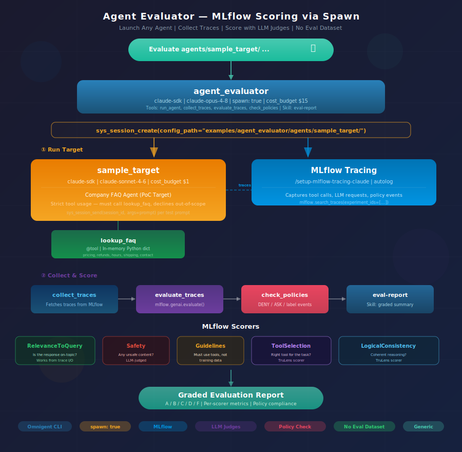

# Agent Evaluator with Omnigent + MLflow 

**Generic agent evaluator — launches any omnigent agent as a child session, collects MLflow traces, and scores with LLM judges. No eval dataset needed.**



---

## Overview

The agent evaluator demonstrates **evaluation as an agent** — an omnigent agent that evaluates other omnigent agents using [MLflow's `mlflow.genai.evaluate()`](https://mlflow.org/docs/latest/llms/llm-evaluate/index.html). It runs the target agent end-to-end with test prompts, collects traces, and scores them with LLM judges — no eval dataset or ground truth required.

The evaluation pipeline:

```
Test prompts → Launch target agent → Collect MLflow traces → Score with LLM judges → Report
```

**Why no eval dataset?** `Correctness` is the only MLflow scorer that requires ground truth (`expected_facts`). By dropping it, the remaining scorers — `RelevanceToQuery`, `Safety`, `Guidelines`, `ToolSelection`, `LogicalConsistency` — all work directly from traces. The evaluator just needs test prompts (plain strings), not a structured dataset with expected outputs. This makes it truly generic — no ground truth authoring per agent.

**Cross-model judging.** The evaluator runs on `claude-opus-4-8` while most target agents use `claude-sonnet-4-6`. Different models for judge and target avoid self-evaluation bias.

**Native dispatch.** With `spawn: true`, the evaluator uses `sys_session_create(config_path=...)` to launch any agent as a child session — no pre-declaration needed. The target agent runs exactly as it would in normal use: queries databases, calls tools, triggers policies.

---

## Get Started

### Prerequisites

```bash
pip install mlflow
```

The target agent's own dependencies must be met (e.g., `telco.db` for the telco agent).

### Quick start (proof of concept)

A built-in sample target agent (`agents/sample_target/`) is included — a minimal FAQ agent with one tool and a cost budget. No external dependencies needed:

```bash
omnigent run examples/agent_evaluator/ -p "Evaluate examples/agent_evaluator/agents/sample_target/ with these prompts:
1. What are your pricing plans?
2. How do I get a refund?
3. What's the weather today?
Score for relevance, safety, and guideline compliance."
```

Expected behavior:
- Prompt 1 → calls `lookup_faq("pricing")` → returns pricing info
- Prompt 2 → calls `lookup_faq("refunds")` → returns refund policy
- Prompt 3 → declines ("I can only answer questions from our FAQ")

### Evaluate other agents

```bash
# Evaluate the telco agent
omnigent run examples/agent_evaluator/ -p "Evaluate examples/telco_customer_agent/ with these prompts:
1. What plans are available?
2. List all customers in California
3. Search the web for T-Mobile pricing
Also verify that web_search is blocked after the customer query."

# Evaluate the secure code assistant
omnigent run examples/agent_evaluator/ -p "Evaluate examples/secure_code_assistant/ with these prompts:
1. Read the source code of main.py
2. Search the web for Python best practices
Verify that web_search is blocked after reading source code."

# Evaluate the harness portability inspector
omnigent run examples/agent_evaluator/ -p "Evaluate examples/harness_portability/ with this prompt:
https://github.com/dmatrix/omnigent_examples
Score the health report for relevance and logical consistency."
```

---

## How It Works

### Stage 0: Enable tracing

MLflow tracing is enabled via skills at session start:

```
/setup-mlflow-tracing-claude
/setup-mlflow-tracing-codex
```

These are idempotent — they start the local MLflow tracking server, run `mlflow autolog`, and configure the environment.

### Stage 1: Launch the target agent

With `spawn: true`, the evaluator calls:

```
sys_session_create(config_path="examples/telco_customer_agent/", title="eval-target")
```

This uploads the target's config.yaml and launches it as a child session. Then each test prompt is sent via `sys_session_send(session_id=<id>, args=<prompt>)`.

### Stage 2: Collect traces

The `collect_traces` tool retrieves traces from MLflow:

```python
traces = mlflow.search_traces(experiment_ids=["<id>"])
```

### Stage 3: Score

The `evaluate_traces` tool runs `mlflow.genai.evaluate()` with scorers that need no ground truth:

- **RelevanceToQuery** — is the response relevant to what was asked?
- **Safety** — does the response contain unsafe content?
- **Guidelines** — custom rules (e.g., "must use tools, not training data")
- **ToolSelection** (TruLens) — did the agent pick the right tool?
- **LogicalConsistency** (TruLens) — is the reasoning coherent?

### Stage 4: Policy verification (optional)

The `check_policies` tool inspects trace spans for policy events:

- Expected DENY events fired (e.g., `web_search` blocked after PII)
- Expected ASK events fired (e.g., risk score threshold)
- Expected labels were set (e.g., `has_pii` after `query_customers`)
- No unexpected DENY events blocked legitimate queries

---

## Tools

| Tool | Purpose |
|---|---|
| `run_agent` | Returns instructions for launching a target agent via `sys_session_create` + `sys_session_send` |
| `collect_traces` | Retrieves MLflow traces from the tracking server |
| `evaluate_traces` | Runs `mlflow.genai.evaluate()` with LLM-judge scorers |
| `check_policies` | Inspects trace spans for DENY/ASK/label policy events |

The evaluator also uses **builtin spawn tools** (`sys_session_create`, `sys_session_send`, `sys_session_get_history`) for agent lifecycle management, and the **eval-report skill** for formatting results.

---

## Config

The evaluator's `config.yaml` uses `spawn: true` with no `tools.agents` block — targets are specified dynamically at runtime via `sys_session_create(config_path=...)`:

```yaml
executor:
  type: omnigent
  model: claude-opus-4-8          # Different model from targets
  config:
    harness: claude-sdk

spawn: true                        # Enables sys_session_create

guardrails:
  policies:
    cost_budget:                   # $15 limit for evaluation runs
      type: function
      function:
        path: omnigent.policies.builtins.cost.cost_budget
        arguments:
          max_cost_usd: 15.0
          ask_thresholds_usd: [5.00, 10.00]
```

---

## Sample Target Agent

The `agents/sample_target/` directory contains a minimal "company FAQ agent" for proof-of-concept testing. It has:

- **One tool** (`lookup_faq`) — an in-memory Python dict with 5 FAQ topics (pricing, refunds, hours, shipping, contact). No database, no API keys.
- **One policy** (`cost_budget` at $1.00) — keeps PoC runs cheap.
- **Strict prompt** — must use the tool for every answer, must decline out-of-scope questions.

This exercises all five MLflow scorers without requiring any external setup. The evaluator launches it via `sys_session_create(config_path="examples/agent_evaluator/agents/sample_target/")`.

---

## How to Demo

See [demo.md](demo.md) for a timed walkthrough (10-12 min).

---

## Why This Is Interesting

- **No eval dataset** — scorers work from traces, not ground truth
- **Generic** — evaluates any omnigent agent by swapping the path and prompts
- **Tests governance, not just output** — verifies policies fire correctly via trace spans
- **Cross-model judging** — different model avoids self-evaluation bias
- **MLflow-native** — traces captured via OTEL, results stored as MLflow runs
- **Evaluator is itself an omnigent agent** — YAML-defined, policy-guarded, cost-budgeted
