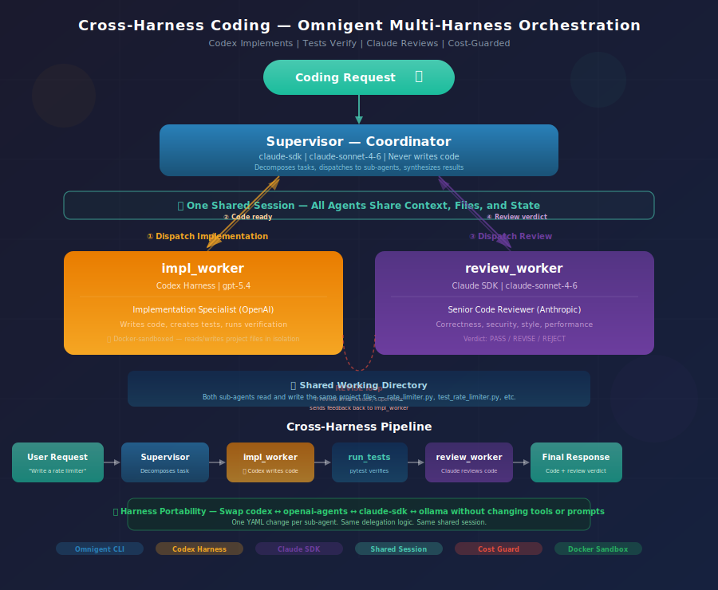

# Cross-Harness Coding

**Codex implements, Claude reviews, one session — multi-harness orchestration in a single YAML.**



---

## Overview

The cross-harness coding example demonstrates **composition** as Omnigent's ability to orchestrate multiple LLM providers within a single agent session. Three different agents, from different providers, collaborate across two harnesses:

- **`Supervisor`** — Lightweight coordinator on the **Claude SDK** harness (Anthropic). Decomposes tasks, dispatches to sub-agents, synthesizes results. Never writes code itself.
- **`impl_worker`** — Implementation specialist on the **Codex** harness (OpenAI). Writes code, creates tests, runs verification.
- **`review_worker`** — Code reviewer on the **Claude SDK** harness (Anthropic). Reviews for correctness, security, style, and performance.

The supervisor breaks down user requests, dispatches implementation to Codex, then routes the result to Claude for review. If the review returns REVISE, the supervisor sends feedback back to the implementer for another pass. All three agents share the same filesystem and session — no copy-paste, no context switching.

This is the pattern described in the Omnigent value proposition as **_composition_**: *"Start a coding task in Codex, then route a subtask to Claude Code while keeping one shared session."*

---

## Get Started

No database or tool setup needed. Both sub-agents use shell access only.

### Prerequisites

- Python 3.12+
- The `omnigent` CLI installed (`pip install omnigent`)
- `ANTHROPIC_API_KEY` in `.env` (for supervisor + reviewer)
- `OPENAI_API_KEY` in `.env` (for implementer)
- Codex CLI installed (`npm i -g @openai/codex`)

> **No Codex CLI?** Swap the implementer to `openai-agents` harness — see [Harness Swapping](#harness-swapping) below.

---

## Run Locally

### 1. Configure credentials (one-time)

```bash
omnigent setup
```

### 2. Export your API keys

```bash
export $(grep ANTHROPIC_API_KEY .env | tr -d '"')
export $(grep OPENAI_API_KEY .env | tr -d '"')
```

### 3. Run the agent

```bash
# Default: Codex implements, Claude reviews
omnigent run examples/cross_harness_coding/

# Fresh session (no persistence)
omnigent run examples/cross_harness_coding/ --no-session
```

---

## Run on Databricks

Override the models to route through Databricks AI Gateway:

```bash
omnigent login https://omnigent-<id>.aws.databricksapps.com
omnigent run examples/cross_harness_coding/ --model databricks-claude-sonnet-4-6 --server https://omnigent-<id>.aws.databricksapps.com
```

---

## Example Queries

**Implement + review pipeline:**
```
Write a Python rate limiter class using the token bucket algorithm.
Put it in rate_limiter.py with unit tests in test_rate_limiter.py.
```

**Security-focused review:**
```
Create a simple REST API health check endpoint in Flask with
authentication. Review it for security issues before we ship.
```

**Refactor + review:**
```
Read app.py, refactor the request handler to use async/await,
then review the refactor for correctness.
```

---

## Harness Swapping

The supervisor's harness can be overridden at the CLI. Sub-agent harnesses are set in `config.yaml`.

**No Codex CLI? Use openai-agents instead:**

Edit `config.yaml` and change the impl_worker's executor:
```yaml
  impl_worker:
    ...
    executor:
      type: omnigent
      model: gpt-5.4
      config:
        harness: openai-agents    # No CLI dependency, just OPENAI_API_KEY
```

**Both agents on Claude (single provider):**
```yaml
  impl_worker:
    ...
    executor:
      type: omnigent
      model: claude-sonnet-4-6
      config:
        harness: claude-sdk
```

**Both agents on OpenAI:**
```yaml
  review_worker:
    ...
    executor:
      type: omnigent
      model: gpt-5.4
      config:
        harness: openai-agents
```

---

## How to Demo (8-10 min)

### Act 1: The YAML (2 min) — "Three agents, two harnesses, one file"

**Show** `config.yaml` — scroll through three sections:

**Say:** "This is one YAML file with three agents. The supervisor runs on Claude. The implementer runs on Codex — OpenAI's coding agent. The reviewer runs on Claude. Two different LLM providers, coordinated by Omnigent."

**Pause on the two `executor:` blocks in the sub-agents:**
> "Same `type: agent` pattern. Same `os_env`. But different harnesses and different models. The framework handles the routing — you don't write any glue code."

---

### Act 2: The Pipeline (4 min) — "Implement and review"

**Run:** `omnigent run examples/cross_harness_coding/ --no-session`

**Prompt:**
```
Write a Python rate limiter class using the token bucket algorithm.
Put it in rate_limiter.py with unit tests in test_rate_limiter.py.
```

**Watch:** The supervisor dispatches to `impl_worker` (OpenAI writes the code), then to `review_worker` (Claude reviews it).

**Say:** "Two different models, two different providers, talking through one session. The implementer wrote the code on Codex. The reviewer read it on Claude. Neither knows the other exists — the supervisor coordinates."

**If review returns REVISE:**
> "The reviewer found an issue. Watch — the supervisor sends the feedback back to the Codex implementer for revision. Same session, same files, different harnesses."

---

### Act 3: The Swap (2 min) — "Same config, different brains"

**Say:** "Your team wants both agents on Claude? One YAML change."

**Show** the harness swapping section — point out that changing `harness: codex` to `harness: claude-sdk` is the only edit.

**Say:** "The tools, the prompts, the delegation logic — nothing changes. Only the executor block. This is what harness portability means. Your workflow survives model migrations."

---

### Timing Summary

| Act | Duration | Focus |
|-----|----------|-------|
| 1. The YAML | 2 min | Three executors, two harnesses, one file |
| 2. The Pipeline | 4 min | Implement on Codex → review on Claude |
| 3. The Swap | 2 min | Swap harnesses without changing tools/prompts |
| **Total** | **8 min** | |

---

## Architecture

| Agent | Harness | Model | Role |
|---|---|---|---|
| **Supervisor** | `claude-sdk` | `claude-sonnet-4-6` | Coordinator — breaks down tasks, routes to sub-agents, synthesizes results |
| **impl_worker** | `codex` | `gpt-5.4` | Implementation — writes code, creates tests, runs verification |
| **review_worker** | `claude-sdk` | `claude-sonnet-4-6` | Review — correctness, security, style, performance analysis |

All three agents share the same `os_env` (filesystem and CWD). The supervisor dispatches sequentially: implement first, then review. If the review returns REVISE, the cycle repeats.

---

## Key Concepts

- **Cross-harness delegation**: Sub-agents run on different LLM providers (Codex + Claude SDK) within one session
- **Shared session**: All agents share the same session tree — context, files, and state persist across harness boundaries
- **Sequential dispatch**: Supervisor enforces implement→review ordering to avoid file conflicts
- **Harness portability**: Swap any agent's harness without changing tools or prompts
- **No custom tools**: Both sub-agents use shell access via `os_env` — no `tools/python/` directory needed
