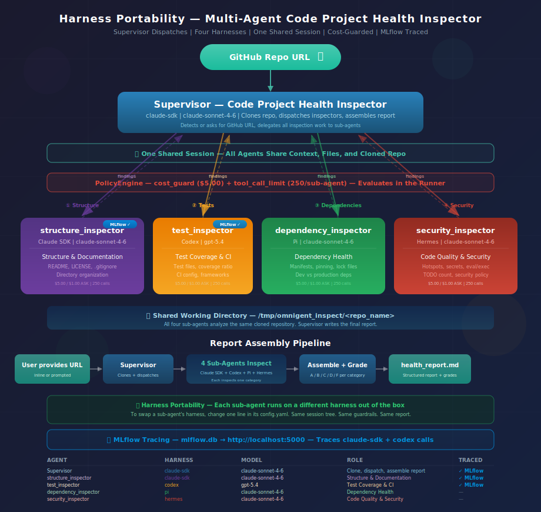

# Harness Portability with Omnigent 

**One supervisor, four inspectors, four harnesses — a Code Project Health Inspector built from composition.**



---

## Overview

A **Code Project Health Inspector** that clones a GitHub repo and dispatches four specialist sub-agents — each on a different harness (Claude SDK, Codex, Pi, Hermes) — to analyze structure, tests, dependencies, and security. Produces a graded `health_report.md`. Five YAML files, zero Python.

Shows: harness portability (swap any sub-agent's harness with a one-line edit), multi-agent composition (one supervisor, four inspectors, one session tree), provider-agnostic governance (same cost guards fire on all four harnesses), and cross-harness MLflow tracing.

### Architecture

- **Supervisor** (`claude-sdk`) — asks for a GitHub repo URL (or accepts one inline), clones the repo, dispatches four inspectors, assembles the final report
- **`structure_inspector`** (`claude-sdk`) — Project Structure & Documentation
- **`test_inspector`** (`codex`) — Test Coverage & CI
- **`dependency_inspector`** (`pi`) — Dependency Health
- **`security_inspector`** (`hermes`) — Code Quality & Security

No `tools/python/` directory — all capabilities come from `os_env` (shell access). The supervisor assembles a `health_report.md` with letter grades and findings from all four inspectors.

---

## Get Started

No database setup needed. No custom tool code. Just YAML.

### Prerequisites

- Python 3.12+
- The `omnigent` CLI installed (`pip install omnigent`)
- `git` installed (for cloning repos to inspect)
- API key(s) and CLI tools for the harnesses you want to use

| Agent | Harness | CLI Tool Required | API Key |
|---|---|---|---|
| Supervisor | `claude-sdk` | None | `ANTHROPIC_API_KEY` in `.env` |
| `structure_inspector` | `claude-sdk` | None | `ANTHROPIC_API_KEY` in `.env` |
| `test_inspector` | `codex` | Codex CLI (`npm i -g @openai/codex`) | `OPENAI_API_KEY` in `.env` |
| `dependency_inspector` | `pi` | Pi CLI (`npm i -g @earendil-works/pi-coding-agent`) | Uses configured provider |
| `security_inspector` | `hermes` | Hermes CLI | Uses configured provider |

> To run the full example out of the box, you need credentials for all four harnesses. To get started quickly, swap the sub-agents you don't have credentials for to `claude-sdk` (one-line edit per sub-agent).

---

## Run Locally

### 1. Configure credentials (one-time)

```bash
omnigent setup
```

### 2. Export your API keys

```bash
# For Claude SDK (supervisor + structure_inspector)
export $(grep ANTHROPIC_API_KEY .env | tr -d '"')

# For Codex (test_inspector)
export $(grep OPENAI_API_KEY .env | tr -d '"')
```

### 3. Enable MLflow tracing

MLflow tracing captures every agent turn, tool call, and policy evaluation across all harnesses. Enable it before running the agent:

**For Claude SDK** (supervisor, structure_inspector):
```
/setup-mlflow-tracing-claude
```

**For Codex** (test_inspector):
```
/setup-mlflow-tracing-codex
```

Each skill is idempotent — safe to run multiple times. It checks/starts the local MLflow tracking server, runs `mlflow autolog` for the harness, configures the environment, and confirms tracing is active. Traces are stored in a local `mlflow.db` SQLite file and viewable at `http://localhost:5000`.

You can also configure tracing manually in `.claude/settings.json`:

```json
{
  "env": {
    "MLFLOW_CLAUDE_TRACING_ENABLED": "true",
    "MLFLOW_TRACKING_URI": "http://localhost:5000",
    "MLFLOW_EXPERIMENT_NAME": "harness-portability-traces"
  }
}
```

With tracing enabled, every run produces a trace tree showing the supervisor dispatching to four sub-agents across four harnesses — with timing, cost, and token usage per span.

### 4. Run the agent

```bash
omnigent run examples/harness_portability/

# Fresh session (no persistence)
omnigent run examples/harness_portability/ --no-session

# Provide a GitHub URL directly (skips the prompt)
omnigent run examples/harness_portability/ --no-session -p "https://github.com/dmatrix/omnigent_examples"
```

The supervisor will ask for a GitHub repository URL, or detect one if you provide it via `-p` or in your first message. It will then clone the repo, dispatch the four inspectors, and generate a health report.

---

## Example Queries

### Recommended for testing (small repos, low token cost)

These repos are small enough to avoid burning tokens yet have enough structure to exercise all four inspectors:

**This repo (smoke test — you know the expected output):**
```
Inspect https://github.com/dmatrix/omnigent_examples
```

**Dual-ecosystem library (Rust + Python, CI, lock files, real tests):**
```
Inspect https://github.com/ijl/orjson
```

**Small companion project (tests, pinned deps, GitHub Actions):**
```
Inspect https://github.com/willmcgugan/textual-web
```

**Well-known HTTP client (thorough README, pytest suite, CI, setup.cfg):**
```
Inspect https://github.com/httpie/cli
```

### Larger projects (more thorough, higher token cost)

**Well-maintained framework:**
```
Inspect https://github.com/pallets/flask
```

**Popular Python library:**
```
Inspect https://github.com/psf/requests
```

### Follow-up after inspection
```
Which findings are the most critical? What should the maintainers fix first?
```

The supervisor clones the repo to `/tmp/omnigent_inspect/<repo_name>`, dispatches four inspectors, and writes `health_report.md` in the current working directory.

---

## Harness Swapping

The CLI `--model`/`--harness` flags override the **supervisor only** — sub-agent harnesses are set in their own `config.yaml` files.

**Override the supervisor:**
```bash
omnigent run examples/harness_portability/ --model gpt-5.4 --harness codex
```

**Swap a sub-agent:** edit one line in its `config.yaml`. For example, to move `test_inspector` from Codex to Claude SDK:

```yaml
# agents/test_inspector/config.yaml
executor:
  type: omnigent
  model: claude-sonnet-4-6       # was: gpt-5.4
  config:
    harness: claude-sdk           # was: codex
```

The prompt, `os_env`, and guardrails stay identical — only the `executor:` block changes.

**Default sub-agent assignments:**

| Agent | Default Harness | Default Model |
|---|---|---|
| `structure_inspector` | `claude-sdk` | `claude-sonnet-4-6` |
| `test_inspector` | `codex` | `gpt-5.4` |
| `dependency_inspector` | `pi` | `claude-sonnet-4-6` |
| `security_inspector` | `hermes` | `claude-sonnet-4-6` |

---

## How to Demo

See [demo.md](demo.md) for a timed walkthrough (8-9 min).

---

## Architecture

| Agent | Role | Harness | Model |
|---|---|---|---|
| **Supervisor** | Clone repo, dispatch inspectors, assemble report | `claude-sdk` | `claude-sonnet-4-6` |
| **`structure_inspector`** | Project Structure & Documentation | `claude-sdk` | `claude-sonnet-4-6` |
| **`test_inspector`** | Test Coverage & CI | `codex` | `gpt-5.4` |
| **`dependency_inspector`** | Dependency Health | `pi` | `claude-sonnet-4-6` |
| **`security_inspector`** | Code Quality & Security | `hermes` | `claude-sonnet-4-6` |

One supervisor, four inspectors. Each inspector's harness is set in its own `config.yaml` and can be swapped independently.

### Request flow

```
1. User provides a GitHub repository URL
2. Supervisor clones the repo to /tmp/omnigent_inspect/<repo_name>
3. Supervisor dispatches four inspectors with the cloned repo path:
   a. structure_inspector (Claude SDK) → structure & docs
   b. test_inspector (Codex)           → tests & CI
   c. dependency_inspector (Pi)        → dependencies
   d. security_inspector (Hermes)      → code quality & security
4. Each inspector analyzes its category and reports findings
5. Supervisor collects findings, assigns letter grades, computes overall score
6. Supervisor writes health_report.md and prints the full report
```

---

## Guardrails

### Supervisor

| Policy | Scope | Limit |
|---|---|---|
| `cost_guard` | Per session | ASK at $1.00, DENY at $5.00 |

### Sub-agents (each)

| Policy | Scope | Limit |
|---|---|---|
| `cost_guard` | Per invocation | ASK at $1.00, DENY at $5.00 |
| `tool_call_limit` | Per invocation | 250 tool calls max |

The cost guard works in two phases:

1. **ASK threshold** (`ask_thresholds_usd`) — the agent pauses and asks for approval when spend crosses the checkpoint. Approve to continue, deny to stop.
2. **Hard limit** (`max_cost_usd`) — when spend reaches the limit, further tool calls are denied. The session stays alive — switch to a cheaper model (via `/model`) or start a fresh session to continue.

The tool call limit on each sub-agent prevents runaway inspection loops. The supervisor has no tool call limit — it only makes a handful of calls (clone + dispatch + write report). All policies are harness-agnostic: they evaluate in the Omnigent runner, not in the LLM harness.

### Cost guard behavior

| Scenario | What happens | How to continue |
|---|---|---|
| **ASK threshold** ($1.00) | The agent pauses and asks for approval. | Approve to continue, or deny to stop. |
| **Hard limit** ($5.00) | Further tool calls are denied. | Switch models with `/model`, or start a fresh session. |
| **Tool call limit** (sub-agent hits 250) | Further tool calls are denied for that sub-agent. The supervisor can still dispatch other sub-agents. | Start a fresh session, or raise `limit` in the sub-agent's `config.yaml`. |

**Adjusting limits:**

```bash
# Start a fresh session (resets all counters)
omnigent run examples/harness_portability/ --no-session
```

To permanently change when the agent pauses, edit the `guardrails:` block in the relevant `config.yaml`:

- **Fewer pauses** — raise `ask_thresholds_usd` (e.g., `[2.00]` instead of `[1.00]`)
- **More tool calls** — raise `limit` in sub-agent configs (e.g., `500` instead of `250`)
- **Higher hard limit** — raise `max_cost_usd` (e.g., `10.0` instead of `5.0`)

---

## Observability (MLflow Tracing)

MLflow tracing captures every agent turn, tool call, and guardrail policy evaluation — stored in a local `mlflow.db` SQLite file and viewable in the MLflow UI at `http://localhost:5000`. Tracing is supported for the **claude-sdk** and **codex** harnesses.

### Enable tracing with skills

Load the setup skills for each supported harness. Each skill is idempotent — safe to run multiple times:

```
/setup-mlflow-tracing-claude     # For claude-sdk harness (supervisor, structure_inspector)
/setup-mlflow-tracing-codex      # For codex harness (test_inspector)
```

Each skill checks/starts the local MLflow tracking server, runs `mlflow autolog` for the harness, configures environment variables, and confirms tracing is active.

### What you see in traces

Once tracing is enabled, open `http://localhost:5000` to see trace trees for each run:

```
harness_portability  (AGENT, claude-sdk)
├── sys_os_shell "git clone ..."  (TOOL)
├── cost_guard  (GUARDRAIL, verdict: ALLOW)
├── structure_inspector  (AGENT, claude-sdk)  ← traced
│   ├── sys_os_shell "find ..."  (TOOL)
│   ├── cost_guard  (GUARDRAIL, verdict: ALLOW)
│   └── tool_call_limit  (GUARDRAIL, verdict: ALLOW)
├── test_inspector  (AGENT, codex)  ← traced
│   └── ...
├── dependency_inspector  (AGENT, pi)
│   └── ...
├── security_inspector  (AGENT, hermes)
│   └── ...
└── sys_os_write "health_report.md"  (TOOL)
```

Each span records the agent name, harness, model, duration, token usage, and policy verdict. The MLflow UI lets you compare runs across different inspections — see which sub-agent used the most tokens, which harness was fastest, and where policy verdicts fired.

### Manual configuration

You can also configure tracing via `.claude/settings.json` instead of using the setup skills:

```json
{
  "env": {
    "MLFLOW_CLAUDE_TRACING_ENABLED": "true",
    "MLFLOW_TRACKING_URI": "http://localhost:5000",
    "MLFLOW_EXPERIMENT_NAME": "harness-portability-traces"
  }
}
```

### Supported harnesses

| Harness | Tracing Support | Setup Skill |
|---|---|---|
| `claude-sdk` | Fully traced | `/setup-mlflow-tracing-claude` |
| `codex` | Fully traced | `/setup-mlflow-tracing-codex` |
| `pi` | Not yet supported | — |
| `hermes` | Not yet supported | — |

