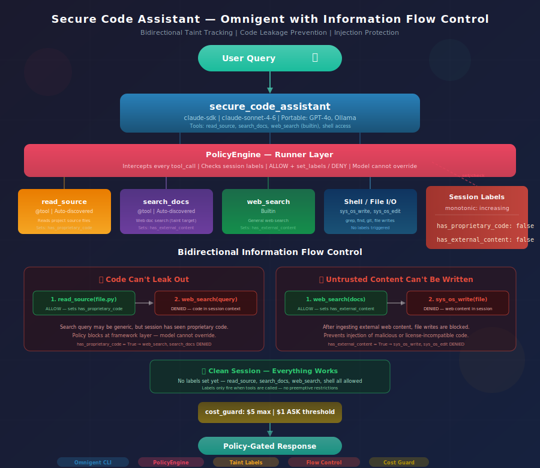
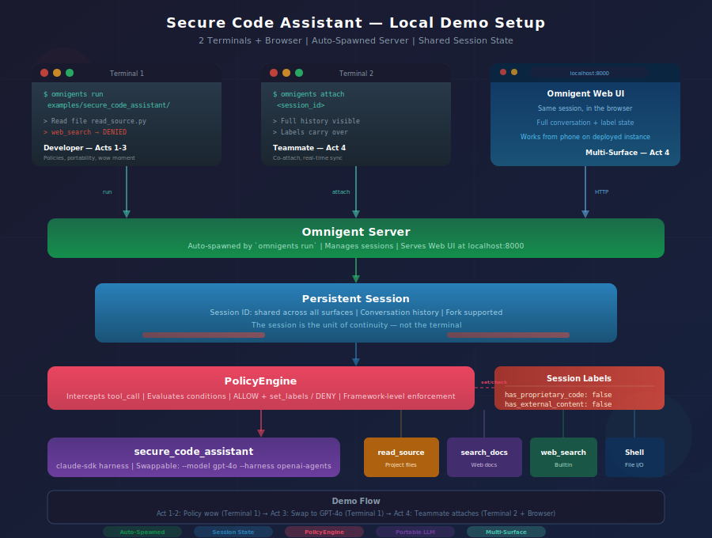

# Secure Code Assistant

**Coding assistant with session-scoped information flow control — blocks web search after code read, blocks file writes after web search.**



---

## Overview

The secure code assistant demonstrates bidirectional information flow control using Omnigent's policy engine. It has two custom tools and one builtin:

- **`read_source`** -- Reads source files from the project directory. Triggers the `has_proprietary_code` label.

- **`search_docs`** -- Searches the web for technical documentation (thin stub for taint separation). Triggers the `has_external_content` label.

- **`web_search`** -- Builtin web search. Triggers the `has_external_content` label. Blocked after proprietary code access.

- **Shell access** -- Run grep, find, git log, etc. via the OS environment.

The policy engine enforces two key boundaries:

1. **Code can't leak out** -- Once proprietary source code is read, web search is denied (search queries could leak implementation details to external search engines).
2. **Untrusted content can't be written in** -- Once web content is ingested, file writes are denied (preventing injection of malicious code or license-incompatible snippets).

Labels are **monotonic** -- once set, they cannot be unset for the session. This is session-scoped information flow control, not request-level scanning.

A **cost budget** guardrail caps total spend at $5 with a $1 approval threshold.

---

## Get Started

No database setup needed. The agent reads source files from the current working directory.

---

## Run on Databricks

Override the model to route through Databricks AI Gateway:

```bash
omnigent login https://omnigent-<id>.aws.databricksapps.com
omnigent run examples/secure_code_assistant/ --model databricks-claude-sonnet-4-6 --server https://omnigent-<id>.aws.databricksapps.com
```

The CLI opens an interactive REPL. A Web UI is also available at the Databricks Apps URL.

---

## Run Locally

The default config uses `claude-sonnet-4-6` via direct Anthropic API. No Databricks dependency.

### 1. Configure credentials (one-time)

```bash
omnigent setup
```

### 2. Export your API key

```bash
export $(grep ANTHROPIC_API_KEY .env | tr -d '"')
```

### 3. Run the agent

```bash
# Default: Claude Sonnet via claude-sdk
omnigent run examples/secure_code_assistant/

# Fresh session (no persistence)
omnigent run examples/secure_code_assistant/ --no-session

# Override model and harness
omnigent run examples/secure_code_assistant/ --model gpt-4o --harness openai-agents
omnigent run examples/secure_code_assistant/ --model ollama/llama-3 --harness openai-agents
```

---

## Example Queries

**Clean session — web search works:**
```
Search the web for Python asyncio best practices
```

**Read source code (sets taint):**
```
Read the file examples/secure_code_assistant/tools/python/read_source.py and explain it
```

**Web search denied after code read:**
```
Use web_search to find how other projects implement tool decorators
→ DENIED: "Web search blocked — proprietary source code is in session context."
```

**Reverse flow — start a new session:**
```
Search the web for the latest FastAPI middleware patterns
→ Works (sets has_external_content)

Write a new middleware file at middleware.py with what you found
→ DENIED: "File write blocked — untrusted web content is in session context."
```

**Cross-verify — code read doesn't block writes:**
```
Read the file examples/secure_code_assistant/config.yaml
→ Works (sets has_proprietary_code only)

Write a summary to notes.txt
→ Works (has_external_content is not set)
```

---

## Policy Engine

The agent's `config.yaml` defines session-scoped guardrails:

### Labels

| Label | Triggered by | Monotonic |
|---|---|---|
| `has_proprietary_code` | `read_source` | Yes (once set, cannot be unset) |
| `has_external_content` | `web_search`, `search_docs` | Yes |

### Policies

| Policy | Condition | Action | Reason |
|---|---|---|---|
| `taint_code_read` | *(always)* | ALLOW `read_source`, set label | Track proprietary code access |
| `taint_web_search` | *(always)* | ALLOW `web_search`/`search_docs`, set label | Track external content ingestion |
| `block_search_after_code` | `has_proprietary_code = True` | DENY `web_search`, `search_docs` | Prevent code leakage via search queries |
| `block_write_after_web` | `has_external_content = True` | DENY `sys_os_write`, `sys_os_edit` | Prevent injection of untrusted web content |
| `cost_guard` | *(always)* | Budget: $5 max, $1 ASK | Cap session cost |

---

## Tools

| Tool | Source | Description |
|---|---|---|
| `read_source` | `tools/python/read_source.py` | Reads a source file from the project directory |
| `search_docs` | `tools/python/search_docs.py` | Stub web doc search (taint target) |
| `web_search` | Builtin | General web search |

---

## How to Demo (10-15 min)



### Pre-demo setup

```bash
export $(grep ANTHROPIC_API_KEY .env | tr -d '"')
export $(grep OPENAI_API_KEY .env | tr -d '"')

# For the collaboration demo (Acts 4):
omnigent server start    # Terminal A (background)
omnigent host            # Terminal B (background)
# Pre-open browser to http://localhost:8000 (hidden tab)
```

---

### Act 1: The Hook (2 min) — "Agents as software"

**Say:** "You already write great agents. Claude Code, Codex, OpenAI — you wire up tools, you ship. But I have three questions. Can you **govern** your agent — not with prompt engineering, but with enforcement the model can't override? Can your teammate **attach** to your live session from their browser? Can you **swap the brain** from Claude to GPT without changing a single tool? Omnigent does all three. And the whole agent is a YAML file."

**Do:** Show `config.yaml` — scroll through three sections:
- `executor:` — "Two lines: which model, which harness. Swap both without touching tools."
- `tools:` — "Python functions auto-discovered from `tools/python/`. Web search as a builtin."
- `guardrails:` — "This is the new thing. Two taint labels, two deny policies, a cost budget. All declarative. The model never gets a vote."

**Pause on `block_search_after_code`:**
> "If the session has seen proprietary source code, web search is denied. Not 'please don't search' — DENIED. The framework intercepts the call before it reaches the model's tools."

---

### Act 2: Policies — Information Flow (4 min) — THE WOW MOMENT

**Do:** `omnigent run examples/secure_code_assistant/`

**Turn 1 — web search works (no code read yet):**

Type: `Search the web for Python asyncio best practices`

Agent calls `web_search` or `search_docs`. Returns results.

**Say:** "Web search works. No proprietary code has been touched."

**Turn 2 — read proprietary source code (sets taint):**

Type: `Read the file examples/secure_code_assistant/tools/python/read_source.py and explain it`

Agent calls `read_source`, returns contents. Framework silently sets `has_proprietary_code: True`.

**Say:** "I just read proprietary source code. Behind the scenes, the PolicyEngine set `has_proprietary_code` to True. That label is **monotonic** — once set, it can never be unset for this session."

**Turn 3 — THE WOW MOMENT — web search denied:**

Type: `Use web_search to find how other projects implement tool decorators`

> **DENIED:** "Web search blocked — proprietary source code is in session context. Search queries could leak implementation details, API keys, or business logic to external search engines."

**Say:** "Denied. The search query 'tool decorators' is generic — zero proprietary content. An API gateway would pass it. But Omnigent knows this *session* loaded source code two turns ago. The query is clean, but the context window is not. This is **session-scoped information flow control** — not request-level scanning."

**Say:** "And this isn't prompt engineering. The enforcement is in the framework layer. The model can't jailbreak around it because the tool call never reaches the harness."

**Turn 4 — reverse flow (write blocked after web):**

Start a new session: `omnigent run examples/secure_code_assistant/ --no-session`

Type: `Search the web for the latest FastAPI middleware patterns`

Web search works. Sets `has_external_content: True`.

Type: `Write a new middleware file at middleware.py with what you found`

> **DENIED:** "File write blocked — untrusted web content is in session context."

**Say:** "Two-way enforcement. Code can't leak out, and untrusted content can't be written in. Both directions, same policy engine, pure YAML."

---

### Act 3: Portability — Same Agent, Different Brain (3 min)

**Say:** "That ran on Claude Sonnet. Your team wants GPT? Same YAML, same tools, same policies."

**Do:** Exit the REPL. Re-run with OpenAI:

```bash
omnigent run examples/secure_code_assistant/ --model gpt-4o --harness openai-agents --no-session
```

Type: `Read the file examples/secure_code_assistant/config.yaml`

Agent calls `read_source`, returns config. Taint fires.

Type: `Use web_search to find YAML schema validation libraries`

> **Same DENY.** "Web search blocked — proprietary source code is in session context."

**Say:** "Same denial. The policy doesn't care which model issued the call. Claude, GPT, Llama — enforcement is in the framework, not the harness. Your compliance rules survive model migrations."

**Mention:** "For fully local: `--model ollama/llama-3 --harness openai-agents`. Zero cloud, zero API keys for the LLM. Same policies."

---

### Act 4: Collaboration — Session Sharing + Multi-Surface (3 min)

**Say:** "You're investigating a bug. Your teammate needs context. In Claude Code, you copy-paste the transcript into Slack. In Omnigent, they attach to your live session."

**Terminal 1:**

```bash
omnigent run examples/secure_code_assistant/
```

Type: `Read examples/secure_code_assistant/config.yaml and summarize the policy structure`

Note the session ID.

**Say:** "This session has a persistent ID. My teammate can attach right now."

**Terminal 2:**

```bash
omnigent attach <session_id>
```

Full conversation history appears. Type: `What labels have been set in this session so far?`

Both terminals show the response in real time.

**Say:** "Both terminals are live. I hand off, they pick up exactly where I left off. Taint labels carry over — the policy state is part of the session, not the terminal."

**Web UI:** Switch to browser at `http://localhost:8000`. Click into the active session.

**Say:** "Same session, in the browser. On a deployed instance, this URL works from your phone. The session is the unit of continuity, not the terminal."

**Fork (if time):** `omnigent run --fork <session_id>` from Terminal 2.

**Say:** "Fork branches the conversation. Like `git branch` for agent sessions."

---

### Act 5: The Close (1 min)

**Say:** "Three pillars in twelve minutes."

- **Governance:** YAML policy engine with taint labels, monotonic state, DENY enforcement the model can't override. Session-scoped information flow control — not prompt engineering, not API gateway scanning.
- **Portability:** Same config.yaml, same Python tools, same policies. Claude, GPT, Ollama. Two CLI flags, zero code changes.
- **Collaboration:** Persistent sessions. Attach, fork, access from CLI, browser, or mobile. Your work isn't trapped in one terminal.

**Say:** "Omnigent isn't replacing Claude Code or Codex. It's the governance, collaboration, and portability layer between your agents and the world. Write agents as software. Ship software as agents."

---

### Timing Summary

| Act | Duration | Pillar |
|-----|----------|--------|
| 1. The Hook | 2 min | Walk through YAML, frame the three questions |
| 2. Policies | 4 min | Taint + DENY both directions (wow moment) |
| 3. Portability | 3 min | Same agent on GPT-4o, same DENY fires |
| 4. Collaboration | 3 min | Attach, co-drive, Web UI, fork |
| 5. Close | 1 min | Recap three pillars |
| **Total** | **13 min** | |
