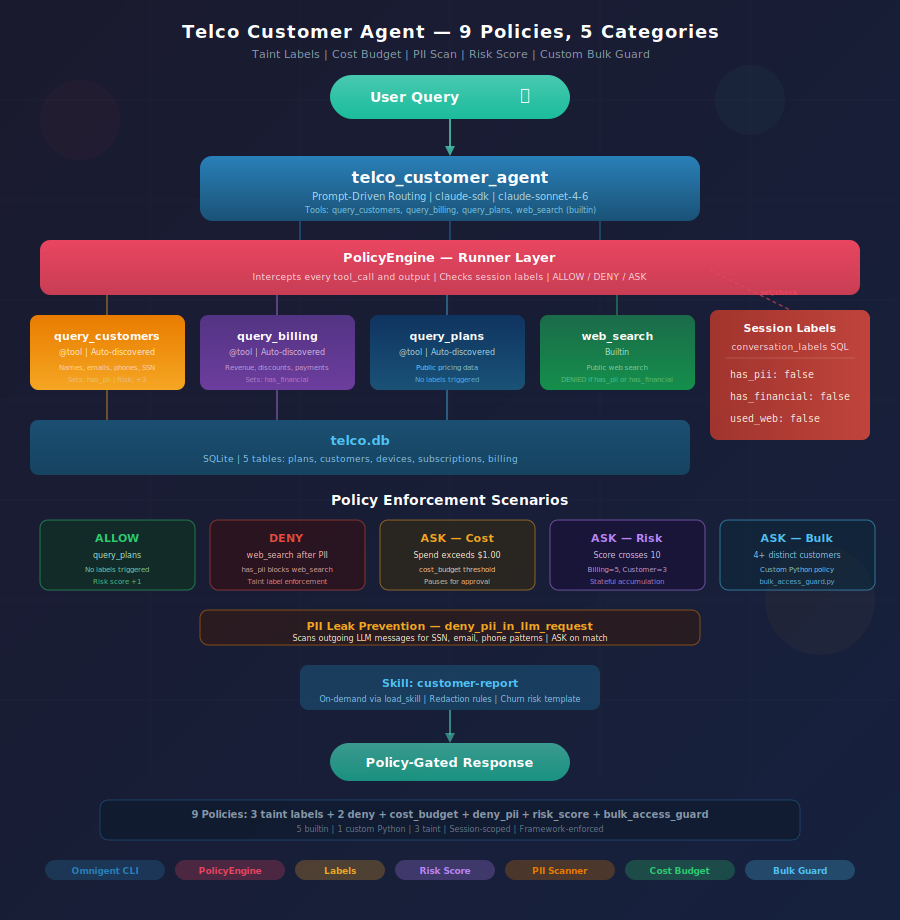

# Telco Customer Agent with Omnigent 

**Multi-tool customer data agent with session-scoped PII and financial policy enforcement.**



---

## Overview

The telco agent demonstrates session-scoped policy enforcement over customer PII and financial data. It has three database tools and one builtin:

- **`query_plans`** -- Queries public plan/pricing data (5 plans mirroring real carrier tiers). Does not trigger any policy labels.

- **`query_customers`** -- Queries the customers and devices tables (20 customers with PII: names, emails, phone numbers, SSN last-4, IMEI). Triggers the `has_pii` label.

- **`query_billing`** -- Queries the billing and subscriptions tables (60 billing records across 3 months, 20 subscriptions with revenue, discounts, payment status). Triggers the `has_financial` label.

- **`web_search`** -- Builtin web search for external/competitor/market questions. Blocked after PII or financial data access.

The agent works with Omnigent's PolicyEngine for session-scoped governance: taint labels track what data the agent has seen, DENY policies block web search after PII/financial access, and ASK policies require human approval before outputting combined PII + financial data.

The agent also includes a **`customer-report` skill** (`skills/customer-report/SKILL.md`) that generates structured quarterly business reviews with PII redaction rules. The skill is loaded on demand via `load_skill` when the user requests a report.

The prompt enforces **strict tool usage** -- the agent must use tools for every answer and declines out-of-scope questions rather than answering from training data.

See the [design doc](design.md) for the full design, policy rationale, and staged implementation plan.

---

## Get Started

Build the database:

```bash
python examples/tools/create_telco_db.py
```

This creates `examples/tools/data/telco.db` with 5 tables and 125 records.

---

## Run on Databricks

Override the model to route through Databricks AI Gateway:

```bash
omnigent login https://omnigent-<id>.aws.databricksapps.com
omnigent run examples/telco_customer_agent/ --model databricks-claude-sonnet-4-6 --server https://omnigent-<id>.aws.databricksapps.com
```

The CLI opens an interactive REPL. A Web UI is also available at the Databricks Apps URL.

---

## Run Locally

The default config uses `claude-sonnet-4-6` via direct Anthropic API (`claude-sdk` harness). Runs fully on your machine with no Databricks dependency.

### 1. Configure credentials (one-time)

```bash
omnigent setup
```

### 2. Export your API key

```bash
export $(grep OPENAI_API_KEY .env | tr -d '"')
```

### 3. Run the agent

```bash
# Uses credentials configured in setup (default: gpt-5.4)
omnigent run examples/telco_customer_agent/

# Override model at the command line
omnigent run examples/telco_customer_agent/ --model gpt-5.4
omnigent run examples/telco_customer_agent/ --model gpt-5.3-codex
omnigent run examples/telco_customer_agent/ --model gpt-4o

# Anthropic Claude (requires ANTHROPIC_API_KEY)
export $(grep ANTHROPIC_API_KEY .env | tr -d '"')
omnigent run examples/telco_customer_agent/ --model claude-sonnet-4-6 --harness claude-sdk

# Ollama (local, no API key needed)
omnigent run examples/telco_customer_agent/ --model ollama/llama-3 --harness openai-agents

# Fresh session (no persistence)
omnigent run examples/telco_customer_agent/ --no-session
```

---

## Example Queries

**Plans** (public data -- no labels triggered):
```
What plans are available and what do they cost?
Compare the Experience More and Experience Beyond plans
```

**Customers** (PII data -- triggers `has_pii`):
```
List all customers in California with their phone numbers
Show me customers whose contracts expire in the next 90 days
```

**Billing** (financial data -- triggers `has_financial`):
```
What's our total monthly revenue across all plans?
Which customers have overage charges this month?
Show me all past-due accounts with amounts owed
```

**Web search denied** (after PII or financial data access):
```
Search the web for competitor pricing on unlimited family plans
→ BLOCKED: "Web search blocked — customer PII is in session context."
```

**Human approval required** (combined PII + financial output):
```
Show me all past-due customers with their names, phone numbers, and amounts owed
→ PAUSED: "Output contains both PII and financial data. Human review required."
```

**Credit data approval** (FDCPA-regulated output):
```
Show me customers with credit class D and their payment history
→ PAUSED: "Output contains credit/collections data. Regulated under FDCPA."
```

**Skill** (on-demand structured report):
```
Use the customer-report skill to produce a quarterly business review
```

**Out-of-scope** (strict tool enforcement -- should decline):
```
What's the weather in San Francisco?
→ "I can only help with telco customer data questions."
```

---

## Policy Engine

The agent's `config.yaml` defines session-scoped guardrails:

### Labels

| Label | Triggered by | Monotonic |
|---|---|---|
| `has_pii` | `query_customers` | Yes (once set, cannot be unset) |
| `has_financial` | `query_billing` | Yes |
| `has_credit` | `query_customers` | Yes |
| `used_web` | `web_search` | Yes |

### Policies

| Policy | Condition | Action | Reason |
|---|---|---|---|
| `block_web_after_pii` | `has_pii = True` | DENY `web_search` | PII in session could leak via search queries |
| `block_web_after_financial` | `has_financial = True` | DENY `web_search` | Financial data in session could leak |
| `approve_pii_financial_output` | `has_pii = True` AND `has_financial = True` | ASK (human approval) | Combined PII + financial output requires review |
| `approve_credit_output` | `has_credit = True` | ASK (human approval) | Credit/collections data regulated under FDCPA |

---

## Database Schema

### `plans`

| Column | Type | Example |
|---|---|---|
| `plan_id` | TEXT | PLAN-ES, PLAN-EM, PLAN-EB |
| `plan_name` | TEXT | Essentials Saver, Experience More |
| `monthly_rate` | INTEGER | 55, 65, 90, 105, 200 |
| `data_limit_gb` | INTEGER | -1 means unlimited |
| `hotspot_gb` | INTEGER | -1 means unlimited, 0 means none |
| `international` | TEXT | none, 5gb_intl, 15gb_intl, unlimited |
| `streaming_perks` | TEXT | none, netflix_ads,apple_tv, etc. |
| `price_guarantee_years` | INTEGER | 0, 3, or 5 |

### `customers`

| Column | Type | Example |
|---|---|---|
| `customer_id` | TEXT | CUST-1001 |
| `name` | TEXT | -- |
| `email` | TEXT | -- |
| `phone_number` | TEXT | -- |
| `ssn_last4` | TEXT | -- |
| `address_state` | TEXT | California, New York |
| `account_type` | TEXT | individual, family, business |
| `credit_class` | TEXT | A, B, C, D |
| `account_status` | TEXT | active, suspended, past_due, churned |
| `signup_date` | TEXT | YYYY-MM-DD |
| `auto_pay` | TEXT | true, false |

### `devices`

| Column | Type | Example |
|---|---|---|
| `device_id` | TEXT | -- |
| `subscription_id` | TEXT | JOIN with subscriptions |
| `make` | TEXT | Apple, Samsung, Google |
| `model` | TEXT | iPhone 16 Pro Max, Galaxy S25 Ultra |
| `imei` | TEXT | -- |
| `installment_monthly` | INTEGER | -- |
| `installment_remaining` | INTEGER | months left |
| `installment_total` | INTEGER | full device price |
| `insurance_plan` | TEXT | none, basic_protect, total_protect |
| `insurance_monthly` | INTEGER | -- |

### `subscriptions`

| Column | Type | Example |
|---|---|---|
| `subscription_id` | TEXT | -- |
| `customer_id` | TEXT | -- |
| `plan_id` | TEXT | -- |
| `contract_start` | TEXT | YYYY-MM-DD |
| `contract_end` | TEXT | YYYY-MM-DD |
| `auto_renew` | TEXT | true, false |
| `discount_pct` | INTEGER | -- |
| `promo_code` | TEXT | -- |
| `ported_from` | TEXT | carrier they switched from, or null |

### `billing`

| Column | Type | Example |
|---|---|---|
| `billing_id` | TEXT | -- |
| `customer_id` | TEXT | -- |
| `month` | TEXT | 2025-04 |
| `plan_charge` | INTEGER | -- |
| `device_installment` | INTEGER | -- |
| `insurance` | INTEGER | -- |
| `overage_charges` | INTEGER | -- |
| `international_charges` | INTEGER | -- |
| `taxes_and_fees` | INTEGER | -- |
| `autopay_discount` | INTEGER | negative, e.g. -10 |
| `promo_discount` | INTEGER | negative, e.g. -21 |
| `total_due` | INTEGER | -- |
| `payment_status` | TEXT | current, past_due_30, past_due_60, collections |
| `late_fee` | INTEGER | -- |

### Common Joins

```sql
-- Customers with devices
SELECT c.name, d.make, d.model FROM customers c
JOIN subscriptions s ON c.customer_id = s.customer_id
JOIN devices d ON s.subscription_id = d.subscription_id

-- Billing with subscriptions
SELECT b.month, b.total_due, s.plan_id FROM billing b
JOIN subscriptions s ON b.customer_id = s.customer_id
```
